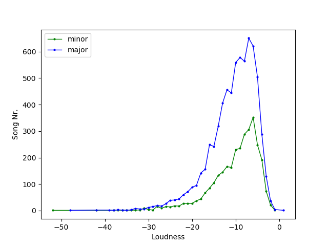
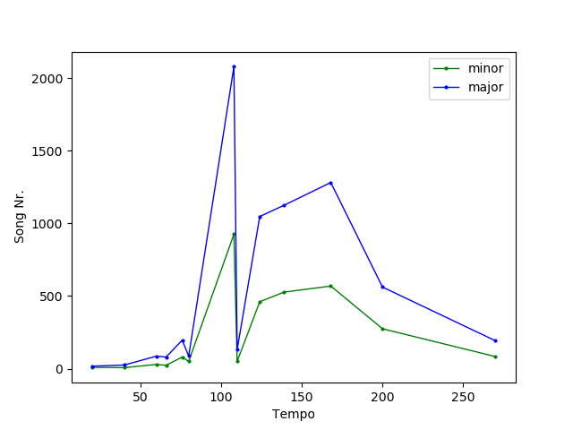

# DCC-spark

## Makefile rules

```sh
make clean
make build
make run TASK=TaskX FILE=/path/to/MillionSongSubsetConverted/ # X=1,2,3
```

## Results

Loudness Comparisson: minor songs vs major songs



Tempo Comparisson: minor songs vs major songs

